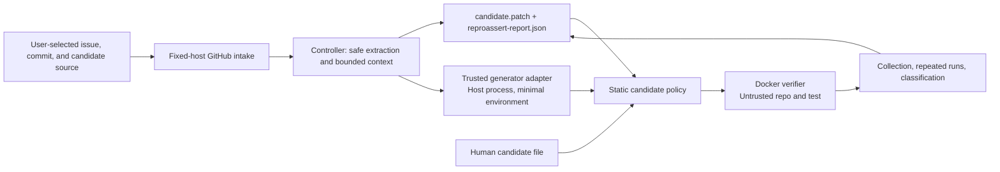

# Architecture

Date: 2026-07-09

Status: implemented strict Python/pytest base-failure slice. Differential and semantic evaluation are separate future work.

## System contract

ReproAssert accepts one canonical public GitHub issue URL, one commit or ref, and exactly one candidate source. The controller resolves an exact SHA, obtains bounded public inputs, validates a test-only candidate, and runs only controller-owned pytest arguments inside Docker.

The current successful terminal state is `repeatable_base_failure`. The product does not apply a production fix, run a fixed revision, or infer semantic or maintainer validity.

## Data flow and trust boundaries



There are four materially different zones:

1. **Networked controller.** It talks only to fixed GitHub hosts during issue and source intake. It resolves the user ref to a full SHA, streams a bounded archive, extracts regular files safely, and constructs bounded context.
2. **Built-in OpenAI adapter.** Only an explicit `--provider openai` selection sends the protocol request to the fixed `api.openai.com` Responses endpoint. It reads `OPENAI_API_KEY`, uses no configurable base URL or redirect, requests strict structured output with `store: false`, and has byte, token, and time bounds. Issue and selected source context leave the machine before Docker verification.
3. **Trusted command adapter.** This optional user-selected host process receives issue text and selected source context through protocol v1. It is not the repository sandbox and may use explicitly passed credentials. Repository and issue content remain untrusted data inside its prompt or logic.
4. **Untrusted Docker verifier.** The extracted repository and candidate run with network disabled, a read-only root and workspace, non-root UID/GID, all capabilities dropped, no new privileges, resource limits, a minimal environment, and no native fallback.

The controller never copies issue instructions into a shell command. Report command fields are ignored during replay; the controller reconstructs its own argument vector.

## Issue intake

`intake.py` accepts only exact ASCII URLs of the form:

```text
https://github.com/OWNER/REPOSITORY/issues/NUMBER
```

It rejects alternate schemes, ports, credentials, query strings, fragments, non-canonical paths, pull requests, and mismatched GitHub responses. The controller then:

1. fetches title and body from `api.github.com` with byte limits;
2. resolves the requested ref through the commits API;
3. records the exact 40-hex SHA;
4. downloads the SHA-pinned archive from `codeload.github.com`; and
5. safely extracts only bounded regular files into a private `0700` run directory.

The source archive is limited to 64 MiB compressed. Extraction permits at most 20,000 members, 256 MiB unpacked data, 4,096-byte paths, and 255-byte path components. Symlinks, hard links, devices, unsafe traversal, duplicate destinations, malformed archives, and special files are rejected.

## Bounded source context

`context.py` walks without following symlinks and excludes common virtual environments, VCS metadata, `node_modules`, and sensitive-looking names. The strict context profile permits:

- at most 5,000 manifest files;
- at most 96 KiB selected UTF-8 source text;
- at most 16 KiB from an individual selected file; and
- a small allowlist of text/configuration suffixes.

Selection prioritizes test and project-configuration files plus paths related to issue terms. Context is convenience for generation, not a security endorsement of any content.

## Candidate sources

### Built-in OpenAI Responses adapter

`--provider openai` is explicit and mutually exclusive with the command and manual paths; the presence of `OPENAI_API_KEY` never selects it. The adapter sends one non-retried `POST /v1/responses` request to `api.openai.com` using the standard-library HTTPS client. Its default model is `gpt-5.4-mini`; `--model` may replace only the model identifier, not the endpoint.

The request carries the complete protocol-v1 object: issue URL/title/body, exact SHA, bounded manifest and selected file content, candidate constraints, attempt, and feedback. The encoded request is capped at 512 KiB. The request sets `store: false`, limits output to 4,096 tokens, and uses a strict JSON Schema with only `test_content`, `expected_symptom`, and `rationale`. The HTTP response is capped at 128 KiB and extracted `output_text` at 64 KiB. Refusals, incomplete generations, provider errors, non-JSON output, and schema violations fail closed without echoing the response or key.

For a candidate that reaches verification, the report records the adapter, requested model, provider-reported resolved model, fixed endpoint host, request duration, bounded provider response ID, and provider-reported input, cached-input, output, and total token counts. It does not infer currency cost because prices change. Failed generation attempts currently abort before a report is written, so a benchmark runner must durably record every attempt and join all measured counts to a frozen price snapshot. No cost or efficiency claim is permitted until that complete ledger exists and scored runs populate it.

### Command adapter

`CommandGenerator` executes a user-trusted executable directly, without a shell. It sends one protocol-v1 JSON request on stdin and expects one JSON object on combined stdout/stderr. The process receives only `LANG`, `LC_ALL`, and names explicitly selected with `--pass-env`; it has a 300-second timeout and 64 KiB output cap.

### Manual file

`--candidate-file` reads at most 32 KiB of UTF-8 and requires the user to provide an expected symptom and rationale. It then enters the same candidate policy and Docker verifier as generated content.

## Static candidate policy

The candidate response must contain exactly `test_content`, `expected_symptom`, and `rationale`. For issue `N`, the controller fixes both identifiers:

```text
tests/reproassert/test_issue_N.py
test_issue_N_reproduction
```

The candidate must compile, define exactly one synchronous test function with that name, and contain the expected-symptom text literally. The strict AST policy rejects, among other cases:

- unconditional false assertions, explicit raises, skip/xfail, and obvious infinite loops;
- executable top-level statements;
- dynamic compilation/import and direct process or shell calls;
- network clients and socket/process-related imports; and
- common bypasses such as `pytest.fail`, `pytest.exit`, `open`, `eval`, `exec`, and sleeps.

This policy is a narrow denylist plus structural contract, not a complete Python safety proof. Docker remains the execution boundary.

## Docker verification

The controller stages the extracted source into a controller-owned Docker volume, changes ownership in a narrowly privileged staging container, and removes that container. Verification then mounts the volume read-only and uses the pinned image with:

| Control | Strict v1 value |
| --- | --- |
| Network | `none` |
| Root filesystem/workspace | read-only |
| User | `65532:65532` |
| Capabilities | all dropped |
| Privilege escalation | `no-new-privileges` |
| CPU / memory / PIDs | 1 CPU / 1 GiB / 128 |
| Per-phase time / output | 60 seconds / 64 KiB |
| Temporary space | 64 MiB tmpfs, `noexec,nosuid,nodev`, 4,096 inodes |
| Host material | no bind mounts, Docker socket, devices, secrets, SSH agent, browser state, proxy variables, or cloud credentials |

The sandbox image contains Python 3.12 and hash-locked pytest dependencies. The strict profile does not install repository dependencies. This is a deliberate initial limit and a frequent expected source of `setup_failure` on real repositories.

Read [sandbox profiles](sandbox-profiles.md), [security model](security-model.md), and [threat model](threat-model.md) for the complete controls and residual risks.

## Collection and result classification

The verifier constructs the exact target itself and first runs collection only. Import/setup errors, collection failure, timeouts, OOM, output overflow, and missing target nodes are rejected.

It then runs the target 2-10 times, default 3. `repeatable_base_failure` requires all of the following:

1. every run exits with pytest failure code `1`;
2. exactly the expected test fails with no errors, skips, or extra failures;
3. the expected-symptom text appears in bounded output or parsed JUnit evidence; and
4. normalized failure fingerprints are identical across every run.

Passing on the base, generic crashes, wrong failures, missing/untrusted test detail, multiple failures, and inconsistent fingerprints produce lower or rejected outcomes.

The local `buggy_slug` integration fixture exercises three identical base failures and the `fixed_slug` fixture exercises `pass_on_base`. This checks the classifier and Docker boundary; it is not a historical issue benchmark result.

## Artifacts and cleanup

Every completed workflow writes exclusive `0600` files into its private run directory:

- `candidate.patch`, a new-file test patch; and
- `reproassert-report.json`, schema `1.0` evidence and limitations.

The report includes full candidate content because replay must validate and restage it. It also includes bounded command output, so reports may contain repository or issue-derived text and should be handled accordingly.

After writing the artifacts, the controller removes its downloaded archive, extracted source tree, Docker containers, and Docker volumes. Cleanup is best effort after abrupt host or Docker failure; stale controller-labeled resources remain a residual operational concern.

## Replay

Replay reads at most 1 MiB from a non-symlink regular report file, validates schema `1.0`, canonical issue URL, repository relationship, full source SHA, candidate hash, candidate policy, and repeat count. It refetches that exact SHA, reruns the same bounded verifier policy, and emits a new report and patch.

The display command stored in the report is never used as execution input.

## Claim ladder

| Claim | Produced by current issue/replay workflow? | Meaning |
| --- | --- | --- |
| `rejected` | Yes | Candidate failed static policy or collection-level evidence. |
| `collected` | Yes | Candidate collected but did not meet the repeatable intended-failure contract. |
| `repeatable_base_failure` | Yes, maximum | The exact generated test failed consistently on the pinned base under strict v1. |
| `differential_reproduction` | No | Would require bounded repeated evidence on both buggy and fixed revisions. |
| `maintainer_validated` | No | Requires recorded independent maintainer evidence. |

The historical benchmark adds hidden-fix execution, causal controls, and blinded semantic review outside the current CLI. See [evaluation.md](evaluation.md). Its current status is 0/20 scored runs.
