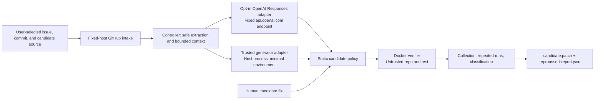

# Architecture

Date: 2026-07-10

Status: implemented strict Python/pytest base-failure slice plus preparation-only causal dependency
and capability-gated differential primitives. No official semantic issuer, scored runner, or public
differential benchmark result exists.

## System contract

ReproAssert accepts one canonical public GitHub issue URL, one commit or ref, and exactly one candidate source. The controller resolves an exact SHA, obtains bounded public inputs, validates a test-only candidate, and runs only controller-owned pytest arguments inside Docker.

The current public issue/replay terminal state is `repeatable_base_failure`. That workflow does not
apply a production fix, run a fixed revision, or infer semantic or maintainer validity. A separate
internal evaluator primitive can run a preverified hidden fixed tree only when given a nominal v0.2
capability that public structural tooling deliberately cannot issue.

## Data flow and trust boundaries



There are four materially different zones:

1. **Networked controller.** It talks only to fixed GitHub hosts during issue and source intake. It resolves the user ref to a full SHA, streams a bounded archive, extracts regular files safely, and constructs bounded context.
2. **Built-in OpenAI adapter.** Only an explicit `--provider openai` selection sends the protocol request to the fixed `api.openai.com` Responses endpoint. It reads `OPENAI_API_KEY`, uses no configurable base URL or redirect, requests strict structured output with `store: false`, and has byte, token, and time bounds. Issue and selected source context leave the machine before Docker verification.
3. **Trusted command adapter.** This optional user-selected host process receives issue text and selected source context through protocol v1. It is not the repository sandbox and may use explicitly passed credentials. Repository and issue content remain untrusted data inside its prompt or logic.
4. **Untrusted Docker verifier.** The extracted repository and candidate run with network disabled, a read-only root and workspace, non-root UID/GID, all capabilities dropped, no new privileges, resource limits, a minimal environment, and no native fallback.

The controller never copies issue instructions into a shell command. Report command fields are ignored during replay; the controller reconstructs its own argument vector.

## Issue intake

`intake.py` accepts only exact ASCII URLs of the form:

```text
https://github.com/OWNER/REPOSITORY/issues/NUMBER
```

It rejects alternate schemes, ports, credentials, query strings, fragments, non-canonical paths, pull requests, and mismatched GitHub responses. The controller then:

1. fetches title and body from `api.github.com` with byte limits;
2. normalizes an already-full SHA or resolves a requested symbolic ref through the commits API;
3. records the exact 40-hex SHA;
4. fetches that commit's root tree OID from GitHub's bounded Git-database endpoint;
5. downloads the SHA-pinned archive from `codeload.github.com`;
6. safely extracts only bounded regular files into a private `0700` run directory; and
7. rewalks the inert extraction through no-follow directory descriptors, computes an independent
   canonical SHA-256 tree digest, reconstructs every Git blob/tree SHA-1 object ID, and requires the
   root tree to equal the commit metadata before generation starts.

The source archive is limited to 64 MiB compressed. Extraction independently caps members, files,
directories, per-file bytes, 256 MiB total unpacked data, 4,096-byte paths, and 255-byte path
components. Symlinks, hard links, devices, unsafe traversal, duplicate destinations, case/Unicode
collisions, every canonical `.git` alias, malformed archives, and special files are rejected. The
post-extraction attestor repeats the type/path/count checks and detects same-run filesystem changes.

### Preparation-only exact-object path

`benchmark prepare-object-source` is a separate source-preparation path; the ordinary issue and
replay commands still use the regular-file contract above. The object path starts from the exact
commit root OID, validates one complete recursive Trees API response, and reconstructs every
subtree/root Git object. It never trusts an entry-provided URL.

Codeload is then parsed as bounded bulk transport without extraction. Exact regular-file bytes and
symlink linknames are reused only when their blob OID matches the tree. Missing or changed blobs are
an explicit bounded repair set fetched by exact OID from a controller-constructed raw Blob API URL.
After every blob is verified, the controller materializes regular files, root-confined tracked
symlinks, and empty uninitialized gitlink directories into a private metadata-free workspace,
rechecks it, commits to a SHA-256 content-tree digest, removes it, and writes the receipt last. A
truncated tree, unsafe symlink chain, unsupported path, excess repair set, or object mismatch fails
closed. See [ADR 0006](decisions/0006-repair-codeload-from-git-objects.md).

## Bounded source context

`context.py` walks without following symlinks and excludes common virtual environments, VCS metadata, `node_modules`, and sensitive-looking names. The strict context profile permits:

- at most 5,000 manifest files;
- at most 96 KiB selected UTF-8 source text;
- at most 16 KiB from an individual selected file; and
- a small allowlist of text/configuration suffixes.

Selection prioritizes test and project-configuration files plus paths related to issue terms. Context is convenience for generation, not a security endorsement of any content.

## Candidate sources

### Built-in OpenAI Responses adapter

`--provider openai` is explicit and mutually exclusive with the command and manual paths; the presence of `OPENAI_API_KEY` never selects it. The adapter sends one non-retried `POST /v1/responses` request to `api.openai.com` using the standard-library HTTPS client. Its default model is `gpt-5.4-mini`; `--model` may replace only the model identifier, not the endpoint.

The request carries the complete protocol-v1 object: issue URL/title/body, exact SHA, bounded manifest and selected file content, candidate constraints, attempt, and feedback. The encoded request is capped at 512 KiB. The request sets `store: false`, limits output to 4,096 tokens, and uses a strict JSON Schema with only `test_content`, `expected_symptom`, and `rationale`. The HTTP response is capped at 128 KiB and extracted `output_text` at 64 KiB. Refusals, incomplete generations, provider errors, non-JSON output, and schema violations fail closed without echoing the response or key.

For a candidate that reaches verification, the report records the adapter, requested model, provider-reported resolved model, fixed endpoint host, request duration, bounded provider response ID, and provider-reported input, cached-input, output, and total token counts. It does not infer currency cost because prices change. Failed generation attempts currently abort before a report is written, so a benchmark runner must durably record every attempt and join all measured counts to a frozen price snapshot. No cost or efficiency claim is permitted until that complete ledger exists and scored runs populate it.

### Command adapter

`CommandGenerator` executes a user-trusted executable directly, without a shell. It sends one protocol-v1 JSON request on stdin and expects one JSON object on combined stdout/stderr. The process receives only `LANG`, `LC_ALL`, and names explicitly selected with `--pass-env`; it has a 300-second timeout and 64 KiB output cap.

### Manual file

`--candidate-file` reads at most 32 KiB of UTF-8 and requires the user to provide an expected symptom and rationale. It then enters the same candidate policy and Docker verifier as generated content.

## Static candidate policy

The candidate response must contain exactly `test_content`, `expected_symptom`, and `rationale`. For issue `N`, the controller fixes both identifiers:

```text
tests/reproassert/test_issue_N.py
test_issue_N_reproduction
```

The candidate must compile, define exactly one synchronous test function with that name, and contain the expected-symptom text literally. The strict AST policy rejects, among other cases:

- unconditional false assertions, explicit raises, skip/xfail, and obvious infinite loops;
- executable top-level statements;
- dynamic compilation/import and direct process or shell calls;
- network clients and socket/process-related imports; and
- common bypasses such as `pytest.fail`, `pytest.exit`, `open`, `eval`, `exec`, and sleeps.

This policy is a narrow denylist plus structural contract, not a complete Python safety proof. Docker remains the execution boundary.

## Docker verification

Before staging, the controller revalidates the candidate, requires the reserved
`tests/reproassert/` path to be absent from the pristine source, creates a private copy, writes exactly
one controller-named test, and attests the complete candidate-applied tree. It then stages that tree
into a controller-owned Docker volume, changes ownership in a narrowly privileged staging container,
and independently attests the staged bytes inside the immutable runner image. Verification mounts
the volume read-only and uses that exact image ID with:

| Control | Strict v1 value |
| --- | --- |
| Network | `none` |
| Root filesystem/workspace | read-only |
| User | `65532:65532` |
| Capabilities | all dropped |
| Privilege escalation | `no-new-privileges` |
| CPU / memory / PIDs | 1 CPU / 1 GiB / 128 |
| Per-phase time / output | 60 seconds / 64 KiB |
| Temporary space | 64 MiB tmpfs, `noexec,nosuid,nodev`, 4,096 inodes |
| Host material | no bind mounts, Docker socket, devices, secrets, SSH agent, browser state, proxy variables, or cloud credentials |

The sandbox image contains Python 3.12 and hash-locked pytest dependencies. The strict profile does not install repository dependencies. This is a deliberate initial limit and a frequent expected source of `setup_failure` on real repositories.

The preparation-only wheel path now has a causal executor. It accepts only a strict plan file; pins
one immutable runner image ID before creating resources; creates fresh, distinct, exactly labeled
local-tmpfs input, wheelhouse, and dependency volumes with byte/inode quotas; holds their mounts with
read-only retention anchors; and runs fixed source-free download followed by network-disabled
offline install. The executor records bounded phase outcomes, attests the wheelhouse before and after
install, attests the installed tree without following links, and issues a nominal typed handle whose
labels, quota, tree, image, and receipt digest are revalidated before every verifier mount.

One canonical receipt binds the strict plan, requirements, policy, immutable image, volume contract,
fixed command/config hashes, phase results, causal sequence, wheelhouse, installed tree, and cleanup
semantics. The independent bounded loader/verifier rejects duplicate JSON keys, noncanonical JSON,
schema or recomputation drift, and caller-supplied readiness claims. The executor context retains sole
cleanup ownership; the verifier only borrows the final volume read-only. Docker bridge egress is
still constrained by fixed trusted pip behavior and post-download hashes, not a network-layer PyPI
allowlist. The ordinary issue/replay workflow remains dependency-free, and no real v0.2 package is
campaign-ready. See [ADR 0007](decisions/0007-dependency-preparation-remains-a-gated-prototype.md).

`reproassert sandbox isolation-canary` exercises a standalone synthetic generator/evaluator mount
profile with two real containers. It is not wired to the current host-side generators and cannot by
itself satisfy the benchmark's oracle-isolation prerequisite. A positive control reads a random evaluator-only sentinel; a generator-view container
has exactly one separate source volume and must neither mount the evaluator path nor find the
sentinel hash in its bounded workspace. Docker's effective image, mounts, network, user,
capabilities, security options, resources, environment clearing, and cleanup are inspected before
the receipt can pass. Only the sentinel SHA-256 is returned. The configuration hash commits the
full expected container policy, scripts, image environment, package version, and optional
caller-supplied tool Git SHA.

Read [sandbox profiles](sandbox-profiles.md), [security model](security-model.md), and [threat model](threat-model.md) for the complete controls and residual risks.

## Capability-gated differential evaluator

The v0.2 structural package code defines a nominal `VerifiedV02EvaluatorCapability`. Its digest binds
the case, base commit/root/content tree, hidden-fixed and fixing-head trees, production/developer
patch identities, evaluator commitment, and either a complete dependency receipt/plan/tree/image set
or an explicit dependency-free mode. The constructor uses an internal issuer token, and every
consumer recomputes the capability digest. The public package verifier deliberately returns no
capability: application-owned controller code must first rederive the private semantic evidence.
The nominal object prevents accidental raw-path composition, not hostile same-process Python:
anything already executing inside the trusted controller can introspect private module state. The
production architecture must keep repository, model, plugin, and package-controlled execution in a
separate sandboxed process; the controller and issuer remain trusted computing base.

Given that capability, the internal differential verifier:

1. revalidates one candidate against the issue and controller-owned path;
2. attests separate pristine base/fixed sources to the capability's root identities;
3. creates and attests `pristine tree + exactly one candidate` workspaces for both roles;
4. stages and re-attests those exact executed trees inside Docker;
5. optionally revalidates and borrows the causally prepared dependency handle; and
6. runs `base, fixed, fixed, base, base, fixed`, requiring three matching intended base failures and
   three exact one-target JUnit passes on the fixed tree.

Raw fixed stdout and JUnit are reduced to digests in the returned public projection. A real local
Docker fixture passes this schedule, but it uses a test-only capability rather than an authentic
v0.2 package. There is no production scored runner, official capability issuer, or public L1 result.
See [ADR 0008](decisions/0008-capability-gated-differential-evaluation.md).

## Collection and result classification

The verifier constructs the exact target itself and first runs collection only. Import/setup errors, collection failure, timeouts, OOM, output overflow, and missing target nodes are rejected.

It then runs the target 2-10 times, default 3. `repeatable_base_failure` requires all of the following:

1. every run exits with pytest failure code `1`;
2. exactly the expected test fails with no errors, skips, or extra failures;
3. the expected-symptom text appears in bounded output or parsed JUnit evidence; and
4. normalized failure fingerprints are identical across every run.

Passing on the base, generic crashes, wrong failures, missing/untrusted test detail, multiple failures, and inconsistent fingerprints produce lower or rejected outcomes.

The local `buggy_slug` integration fixture exercises three identical base failures and the
`fixed_slug` fixture exercises `pass_on_base`. A separate differential fixture exercises the full
six-run interleaving. These check classifiers and the Docker boundary; neither is a historical issue
benchmark result.

Each pytest phase receives a fresh 2 MiB, 64-inode local-tmpfs result volume. A separate inspected
anchor container keeps that mount alive only long enough for the controller to read
`/results/junit.xml` through a fixed isolated reader. The anchor has no network, a read-only root,
non-root identity, dropped capabilities, private cgroup/IPC namespaces, 0.1 CPU, 64 MiB memory,
16 PIDs, no Docker logs, and no source/dependency mount. JUnit remains bounded hostile evidence, not
an attestation.

## Artifacts and cleanup

Every completed workflow writes exclusive `0600` files into its private run directory:

- `candidate.patch`, a new-file test patch; and
- `reproassert-report.json`, schema `1.1` evidence and limitations.

The report includes full candidate content because replay must validate and restage it, plus the
candidate-applied `executed_tree_sha256`. Replay reconstructs the same private overlay and rejects a
different executed tree. The report also includes bounded command output, so reports may contain
repository or issue-derived text and should be handled accordingly.

After writing the artifacts, the controller removes its downloaded archive, extracted source tree, Docker containers, and Docker volumes. Cleanup is best effort after abrupt host or Docker failure; stale controller-labeled resources remain a residual operational concern.

Benchmark `prepare-source` is intentionally different: it preserves the source archive and writes
its receipt last in a private case directory, while deleting the extraction. `verify-source` stages
a private copy, independently re-fetches the commit tree from the frozen manifest/base SHA, repeats
extraction and attestation, and requires checked cleanup before returning success. The 20-receipt
index is deterministic and inert; it does not mutate a campaign, ledger, generator, or evaluator.

`prepare-object-source` likewise preserves its inert codeload archive, but writes a distinct v2
receipt and case-directory suffix so it cannot overwrite a v1 receipt. Its verifier stages a private
archive copy, freshly re-fetches commit/tree metadata and any planned exact blobs, re-materializes
and removes the workspace, and compares every derived receipt field. No object-source index or
campaign-readiness mutation is currently implemented.

## Replay

Replay reads at most 1 MiB from a non-symlink regular report file and validates the bounded fields it
consumes. It refetches the exact commit metadata and archive, requires the archive SHA-256 to match
the report, reconstructs and checks the Git root tree again, compares the recorded canonical tree
SHA-256 when present, then reruns the controller-owned verifier policy. Schema-1.1 reports require
the candidate-applied executed-tree SHA-256 and replay requires the rebuilt overlay to match. Older
schema-1.0 reports remain supported and receive a fresh commit-tree attestation, but they do not gain
the missing historical executed-tree field retroactively.

The display command stored in the report is never used as execution input.

## Claim ladder

| Claim | Produced by current issue/replay workflow? | Meaning |
| --- | --- | --- |
| `rejected` | Yes | Candidate failed static policy or collection-level evidence. |
| `collected` | Yes | Candidate collected but did not meet the repeatable intended-failure contract. |
| `repeatable_base_failure` | Yes, maximum | The exact generated test failed consistently on the pinned base under strict v1. |
| `differential_reproduction` | Not from issue/replay; internal primitive only | Requires a nominal evaluator capability and three matching base failures plus three exact fixed passes. No official issuer or public result exists. |
| `maintainer_validated` | No | Requires recorded independent maintainer evidence. |

The historical benchmark still adds causal controls and blinded semantic review beyond the
differential primitive. See [evaluation.md](evaluation.md). Its current status is 0/20 scored runs,
0/20 public L1 results, and 0/20 semantic-valid results.
